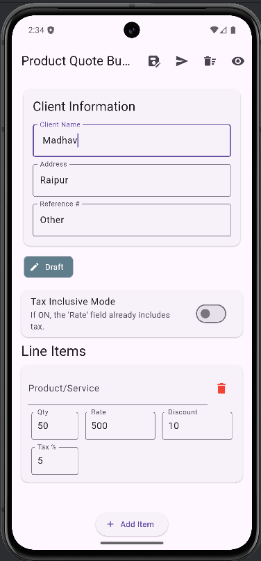
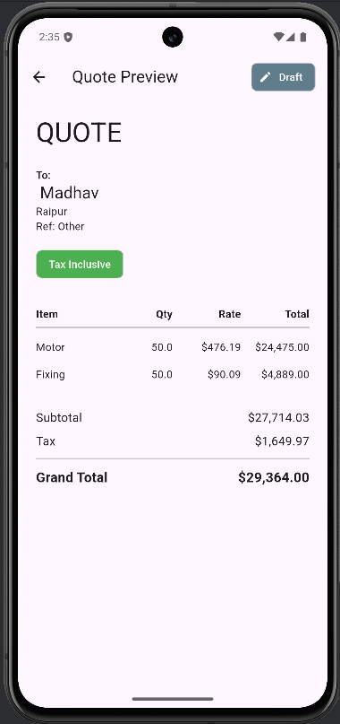

# Product Quote Builder (Flutter)

A Flutter application built to meet the "Product Quote Builder" task. This app allows a user to dynamically build a product/service quotation form, which calculates totals in real-time and provides a professional preview.

The app is built entirely using free-tier tools (Flutter, Provider for state management, and local storage) and fully implements all core and bonus requirements.

## Features

Core Requirements
- Client Info: Form for Client Name, Address, and Reference.
- Dynamic Line Items: Users can add or remove product/service rows.
- Real-time Calculations: Subtotal, Tax, and Grand Total update instantly as the user types.
- Responsive UI: Form layout adapts cleanly to different screen sizes.
- Quote Preview: A clean, non-editable "printable" preview screen.

## Bonus Features Implemented

- Currency Formatting: All totals are formatted as USD (e.g., $4,000.00).
- Save & Load Locally: The current quote (including client info, items, and tax mode) is automatically saved to the device. When the app is closed and reopened, the quote is reloaded.
- Tax Mode: A "Tax Inclusive" switch allows the user to change the calculation logic.
- Exclusive (OFF): "Rate" is the pre-tax price.
- Inclusive (ON): "Rate" is the final, post-tax price.

Quote Status Tracking:
Quotes begin as a Draft.
A "Send" button simulates sending the quote, changing its status to Sent.
Once "Sent," the quote becomes read-only to prevent edits.
Clear Action: A "Clear" button with a confirmation dialog allows the user to start a new, blank quote.

📸 Screenshots

1. Filled Quote Form
   This screen shows the client info, the tax-mode switch, and multiple line items. All fields are disabled because this quote has been marked as "Sent".

2. Quote Preview
   This screen shows the clean, professional layout of the final quote, including the status and tax mode.

🛠️ Tech Stack
Framework: Flutter
Language: Dart
State Management: provider
Local Storage: shared_preferences (for saving and loading quotes)

Utilities:
intl: For currency formatting.
uuid: For generating unique IDs for line items.

🚀 How to Run
Ensure you have the Flutter SDK installed.

Clone this repository:

Bash

git clone https://github.com/CHSHAKISH/Quote-Builder.git
cd YOUR-REPO-NAME
Install dependencies:

Bash

flutter pub get
Run the app:

Bash

flutter run
How to Add Your Screenshots:
Take screenshots of your app.

In GitHub, go to your repository.

Click on the README.md file and click the "Edit" (pencil) icon.

Drag and drop your images into the text area where the `` placeholders are. GitHub will upload them and give you a link.

Commit the changes.
